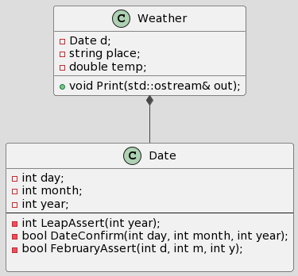

# **Основы проектирования программного обеспечения**
	- Симанов Иван Николаевич КИ22-06Б
	- Вариант 6: Измерения температуры: дата, место измерения (строка), значение (дробное)
Соглашение о кодировании: [Google C++ Style Guide](https://google.github.io/styleguide/cppguide.html/)
